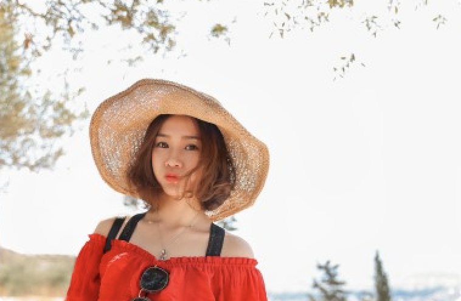
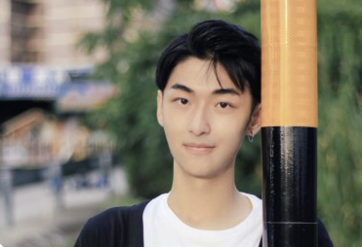
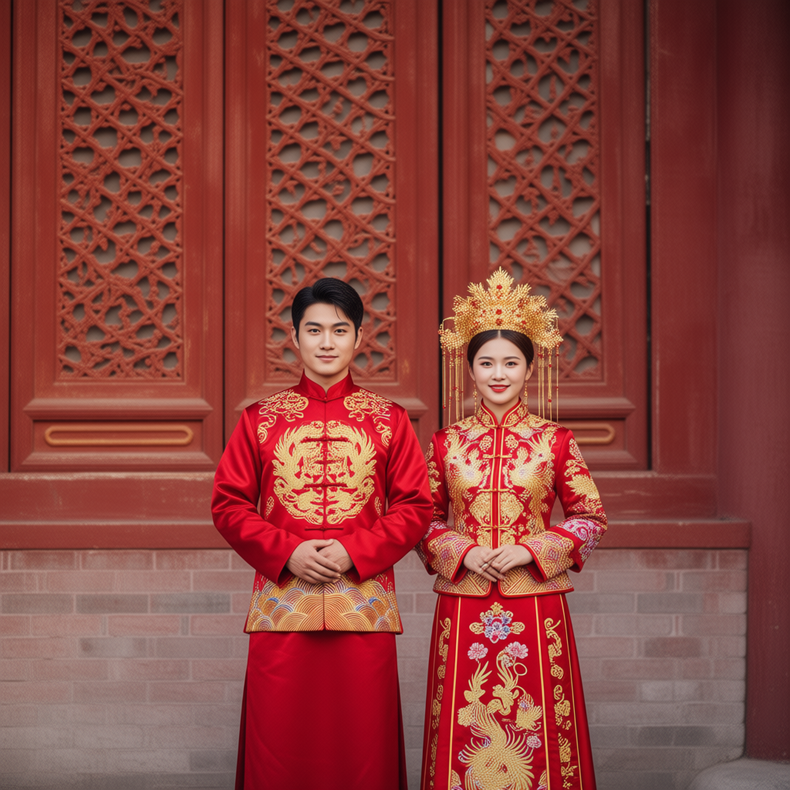
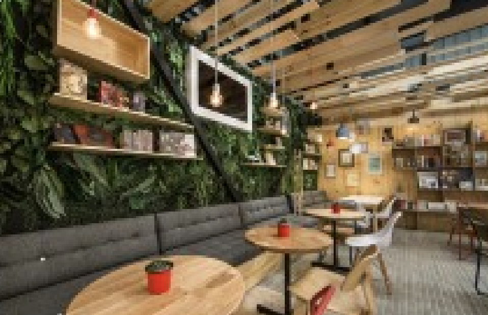
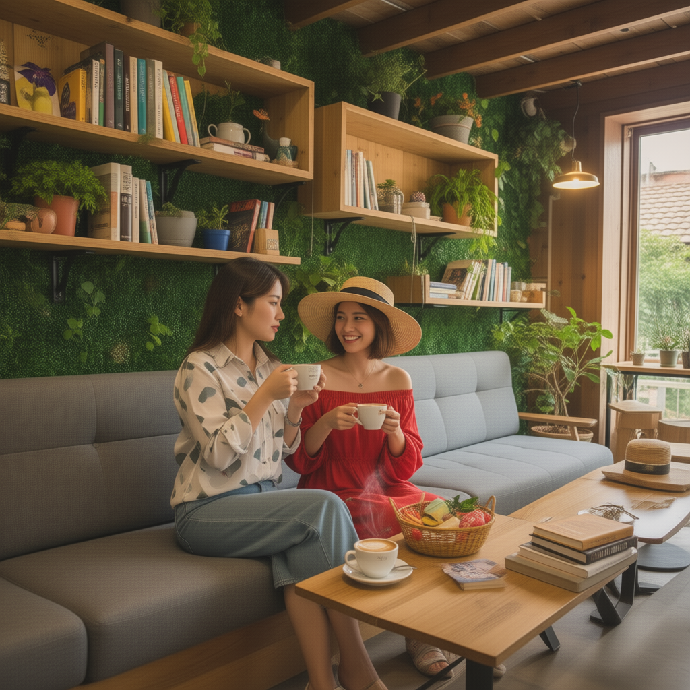
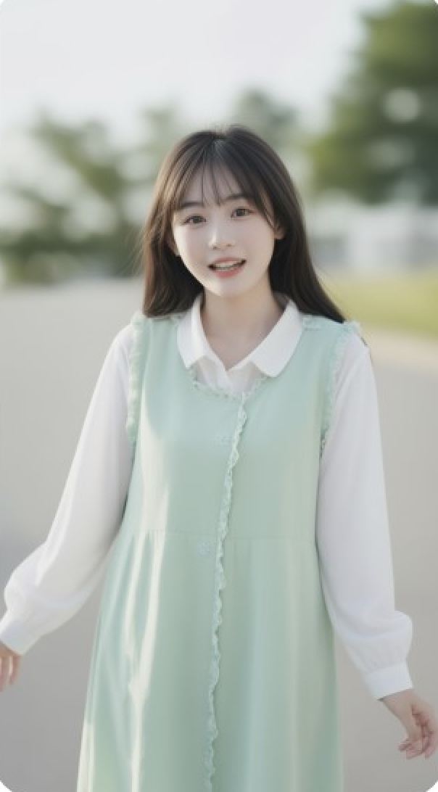
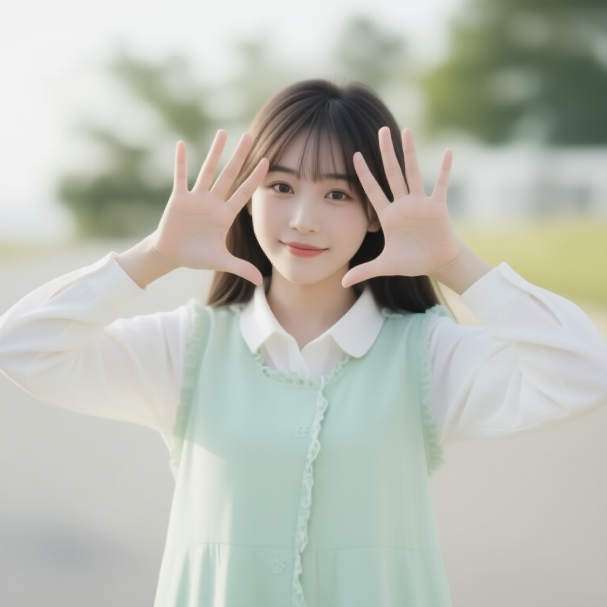
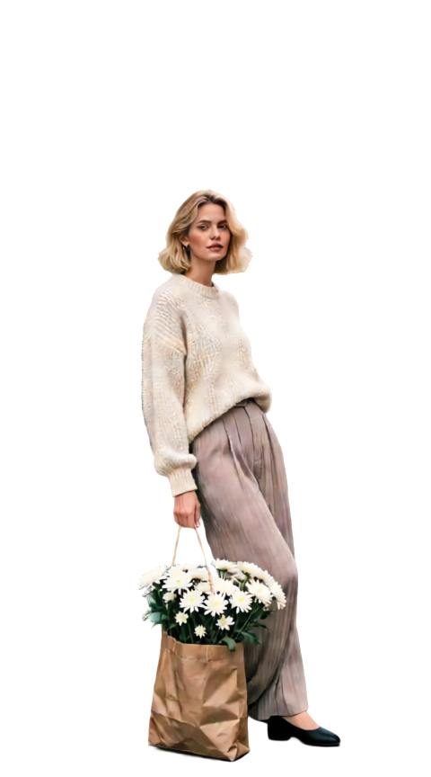

# Qwen Image Swift

Swift port of Qwen Image runs on Apple Silicon Macs using **[mlx-swift](https://github.com/ml-explore/mlx-swift)**.

## Release CLI

The CLI can run on a 32 GB machine by using 8-bit quantized model weights pulled from Hugging Face.

### Requirements

- Apple Silicon Mac running macOS 14 Sonoma or newer.
- Minimum 32 GB unified memory for the 8-bit quantized weights and runtime.

### Download the CLI

Grab the latest signed `QwenImageCLI` binary from the [0.1.0 release](https://github.com/mzbac/qwen.image.swift/releases/tag/0.1.0). The asset is shipped as a zipped bundle; you can automate the download/unzip like this:

```bash
curl -L https://github.com/mzbac/qwen.image.swift/releases/download/0.1.0/qwen.image.macos.arm64.zip \
  -o qwen.image.macos.arm64.zip
unzip -o qwen.image.macos.arm64.zip -d qwen-image-cli
cd qwen-image-cli
chmod +x QwenImageCLI
./QwenImageCLI -h
```

```bash
./QwenImageCLI \
  --model mzbac/Qwen-Image-Edit-2511-8bit \
  --true-cfg-scale 1.0 \
  --guidance 1.0 \
  --steps 4 \
  --lora lightx2v/Qwen-Image-Edit-2511-Lightning:Qwen-Image-Edit-2511-Lightning-4steps-V1.0-bf16.safetensors \
  --prompt "Analog film photo of an astronaut riding a horse on Mars at golden hour" \
  --seed 42 \
  --width 512 \
  --height 512 \
  --output outputs/astronaut.png
```

#### Pose editing example

```bash
./QwenImageCLI \
  --model mzbac/Qwen-Image-Edit-2511-8bit \
  --true-cfg-scale 1.0 \
  --guidance 1.0 \
  --steps 4 \
  --lora lightx2v/Qwen-Image-Edit-2511-Lightning:Qwen-Image-Edit-2511-Lightning-4steps-V1.0-bf16.safetensors \
  --reference-image images/person4.png \
  --prompt "她双手举起，手掌朝向镜头，手指张开，做出一个俏皮的姿势"
```

The reference photo at `images/person4.png` plus the LoRA lightning adapter above reproduce the pose edit shown in `examples/pose_editing.png`.

#### Character placement example

```bash
./QwenImageCLI \
  --model mzbac/Qwen-Image-Edit-2511-8bit \
  --true-cfg-scale 1.0 \
  --guidance 1.0 \
  --steps 4 \
  --lora lightx2v/Qwen-Image-Edit-2511-Lightning:Qwen-Image-Edit-2511-Lightning-4steps-V1.0-bf16.safetensors \
  --reference-image images/background.png \
  --reference-image images/person1.png \
  --prompt "图2中的女生在图1的沙发上 喝咖啡"
```

The first reference injects the living room background and the second reference contributes the subject, producing the composition shown in `examples/character_placement.png`.

#### Wedding portrait example

```bash
./QwenImageCLI \
  --model mzbac/Qwen-Image-Edit-2511-8bit \
  --true-cfg-scale 1.0 \
  --guidance 1.0 \
  --steps 4 \
  --lora lightx2v/Qwen-Image-Edit-2511-Lightning:Qwen-Image-Edit-2511-Lightning-4steps-V1.0-bf16.safetensors \
  --reference-image images/person1.png \
  --reference-image images/person2.png \
  --prompt "根据这图1中女性和图2中的男性，生成一组结婚照，并遵循以下描述：新郎穿着红色的中式马褂，新娘穿着精致的秀禾服，头戴金色凤冠。他们并肩站立在古老的朱红色宫墙前，背景是雕花的木窗。光线明亮柔和，构图对称，氛围喜庆而庄重。"
```

This setup reuses both reference portraits to synthesize the stylized wedding shot stored at `examples/wedding.png`.

#### Layered image decomposition example

The CLI also supports layered image decomposition using the [Qwen-Image-Layered](https://huggingface.co/Qwen/Qwen-Image-Layered) model, which separates an image into foreground and background layers.

```bash
./QwenImageCLI \
  --model mzbac/Qwen-Image-Layered-8bit \
  --layered \
  --layered-image images/layered_input.png \
  --layered-layers 2 \
  --layered-resolution 640 \
  --steps 20 \
  --seed 42 \
  --output outputs/layered/
```

This decomposes the input image into 2 layers (foreground and background), producing separate PNG files for each layer. The `--layered-resolution` flag accepts 640 or 1024 as resolution buckets.

Layered generation flags:
- `--layered` enables layered decomposition mode
- `--layered-image` specifies the input image to decompose
- `--layered-layers` sets the number of layers to generate (default: 4)
- `--layered-resolution` sets the resolution bucket: 640 or 1024 (default: 640)
- `--layered-cfg-normalize` enables/disables CFG normalization (default: true)

Key flags:

- `--prompt` accepts the same multi-condition syntax as upstream Qwen Image.
- `--negative-prompt` lets you suppress artifacts (e.g. "blurry, low contrast").
- `--guidance`, `--true-cfg-scale`, and `--steps` provide full control over the diffusion schedule.
- `--model`, `--revision`, and `--lora` point the CLI at Hugging Face repos or local safetensors.
- When a LoRA repo contains multiple weights, pass a specific file via `--lora owner/repo:filename.safetensors` or a Hugging Face file URL.
- `--reference-image` can be supplied multiple times for image-to-image or pose-guided edits.

Run `./QwenImageCLI -h` for the exhaustive list and keep an eye on the release notes for newly added knobs.

## LoRA Weight Files

When a LoRA repo contains multiple weights, you can select an exact file using either a `repo:file` selector or a Hugging Face file URL.

### Repo + weight selector

```bash
./QwenImageCLI \
  --model Qwen/Qwen-Image-Edit-2511 \
  --true-cfg-scale 1.0 \
  --guidance 1.0 \
  --steps 4 \
  --lora lightx2v/Qwen-Image-Edit-2511-Lightning:Qwen-Image-Edit-2511-Lightning-4steps-V1.0-bf16.safetensors \
  --reference-image images/person4.png \
  --prompt "她双手举起，手掌朝向镜头，手指张开，做出一个俏皮的姿势" \
  --output outputs/pose_edit_2511_4steps.png
```

### Hugging Face file URL

```bash
./QwenImageCLI \
  --model Qwen/Qwen-Image-Edit-2511 \
  --true-cfg-scale 1.0 \
  --guidance 1.0 \
  --steps 4 \
  --lora https://huggingface.co/lightx2v/Qwen-Image-Edit-2511-Lightning/blob/main/Qwen-Image-Edit-2511-Lightning-4steps-V1.0-bf16.safetensors \
  --reference-image images/person4.png \
  --prompt "她双手举起，手掌朝向镜头，手指张开，做出一个俏皮的姿势" \
  --output outputs/pose_edit_2511_4steps.png
```

## Examples

The `examples/` folder contains a few straight-from-the-CLI renders to showcase current fidelity:

| Prompt | Translation | Reference images | Output |
| --- | --- | --- | --- |
| Analog film photo of an astronaut riding a horse on Mars at golden hour | Same as prompt | — |  |
| 根据这图1中女性和图2中的男性，生成一组结婚照，并遵循以下描述：新郎穿着红色的中式马褂，新娘穿着精致的秀禾服，头戴金色凤冠。他们并肩站立在古老的朱红色宫墙前，背景是雕花的木窗。光线明亮柔和，构图对称，氛围喜庆而庄重。 | “Using the woman from image 1 and the man from image 2, create a set of wedding photos. The groom wears a red traditional Chinese jacket, the bride wears an ornate Xiuhe dress with a golden phoenix crown. They stand side by side before an old vermilion palace wall with carved wooden windows, bright soft lighting, symmetric composition, festive yet solemn mood.” |   |  |
| 图2中的女生在图1的沙发上 喝咖啡 | “Place the girl from image 2 on the sofa from image 1, drinking coffee.” |   |  |
| 她双手举起，手掌朝向镜头，手指张开，做出一个俏皮的姿势 | "She raises both hands toward the camera, fingers spread, striking a playful pose." |  |  |

### Layered decomposition

The layered mode decomposes an input image into separate foreground/background layers:

| Input (480x864) | Layer 1 (background, 480x864) | Layer 2 (foreground, 480x864) |
| --- | --- | --- |
|  |  |  |

Feel free to reference these prompts to validate your environment; recreating them should produce similar compositions within minor stochastic differences.

### Layered edit

Using the decomposed layers as references to place the subject into a Sydney CBD scene:

```bash
./QwenImageCLI \
  --model Qwen/Qwen-Image-Edit-2511 \
  --true-cfg-scale 1.0 \
  --guidance 1.0 \
  --steps 4 \
  --edit-resolution 1024 \
  --width 1024 \
  --height 1024 \
  --lora lightx2v/Qwen-Image-Edit-2511-Lightning:Qwen-Image-Edit-2511-Lightning-4steps-V1.0-fp32.safetensors \
  --reference-image examples/layered_layer_1.png \
  --reference-image examples/layered_layer_2.png \
  --prompt "Using Picture 2 as the subject, place her naturally into a photo-realistic Sydney, Australia city street scene (Sydney CBD with light rail; subtle Sydney Opera House or Harbour Bridge in the distance). Keep her pose, face, hair, outfit, and flower bag from Picture 2, but ensure she is leaning against a real support (the side of a stopped light-rail tram or a nearby pole/rail) so the contact makes physical sense. Match lighting, perspective, and shadows." \
  --output examples/sydney_edit_2511.png
```

| Original input (480x864) | Layer 1 (480x864) | Layer 2 (480x864) | Edited output (1024x1024) |
| --- | --- | --- | --- |
|  |  |  |  |

## Acknowledgements

* **[mlx-swift](https://github.com/ml-explore/mlx-swift):** This project is built using the `mlx-swift` library by Apple Machine Learning Research to enable efficient model execution on Apple Silicon.
* **[Hugging Face Diffusers](https://github.com/huggingface/diffusers):** Implementation logic is referenced from the Diffusers library.

## License

The project is licensed under the terms of the [GNU GPL v3](LICENSE). Commercial usage is allowed as long as your downstream distribution also complies with GPLv3.
